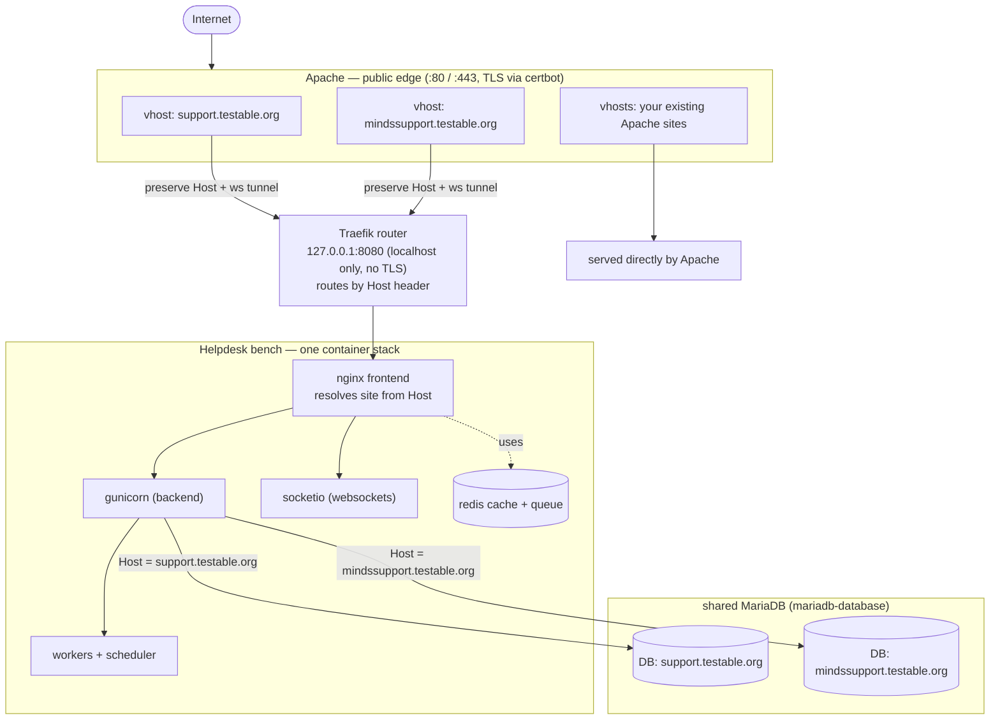

# Self-hosted Frappe Helpdesk (Docker, two sites, Apache edge)

Production setup for **Frappe Helpdesk** serving two sites:

- `support.testable.org`
- `mindssupport.testable.org`

Both run on **one bench** (one container stack) but have **fully separate
databases**, resolved by hostname (Frappe DNS-based multitenancy). It:

- runs as an **immutable Docker image** (apps baked at build time — the official
  `frappe_docker` production pattern, *not* the dev `bench start` demo),
- coexists with future **other Frappe instances** on the same server,
- coexists with **Apache**, which keeps owning ports **80/443** as the public
  TLS edge and reverse-proxies to Frappe.

## Architecture

```
            Apache (:80/:443, TLS via certbot)        <-- public edge you already run
              |  support.testable.org       -> 127.0.0.1:8080  (Host preserved)
              |  mindssupport.testable.org  -> 127.0.0.1:8080  (Host preserved)
              |  your-existing-sites        -> served by Apache directly
              v
        Traefik router (127.0.0.1:8080, localhost only)   <-- internal, no TLS
              |  Host(support.testable.org) || Host(mindssupport...) -> helpdesk bench
              v
        [ helpdesk bench ]  nginx + gunicorn + socketio + workers + scheduler + redis
              |  site resolved from Host header:
              |     support.testable.org      -> its own DB
              |     mindssupport.testable.org  -> its own DB
              v
        shared MariaDB (mariadb-database)   <-- one DB engine, two databases
```



Why Traefik when Apache is already the edge? It's the single internal entry
point: every Apache vhost proxies to the same `127.0.0.1:8080` and Traefik
routes by hostname. When you add the *other* Frappe instances later, Apache
needs no new ports — just another vhost.

| Component   | Version            |
|-------------|--------------------|
| Frappe      | `version-16`       |
| Helpdesk    | `main`             |
| Telephony   | `develop`          |

**Why telephony?** It is a hard dependency of Helpdesk — `helpdesk/hooks.py`
declares `required_apps = ["telephony"]` and `pyproject.toml` pins
`telephony >=0.0.1,<1.0.0`. Frappe refuses to install `helpdesk` without it.
It's installed automatically; ignore its UI if you don't use call features.

## Files in this directory

| File | Purpose |
|------|---------|
| `apps.json` | Apps baked into the image (frappe comes from build args). |
| `build.sh` | Build the custom `helpdesk:v16` image. |
| `deploy.sh` | Bring up MariaDB + Traefik + the helpdesk bench. |
| `create-site.sh` | One-time: create **both** sites + install apps. |
| `gitops/mariadb.env` | Shared DB root password. |
| `gitops/traefik.env` | Internal router (localhost:8080) + dashboard auth. |
| `gitops/helpdesk.env` | Bench image, DB, and the two hostnames it serves. |
| `apache/support.testable.org.conf` | Apache vhost: TLS + proxy + websockets. |
| `apache/mindssupport.testable.org.conf` | Second site's vhost. |

> Replace every `CHANGE_ME...` before deploying.

---

## Deploy (on the server)

### 0. Prereqs
Docker + Docker Compose v2; Apache with `mod_proxy mod_proxy_http
mod_proxy_wstunnel mod_ssl mod_rewrite mod_headers`; DNS A-records for both
hostnames pointing at the server.

### 1. Get frappe_docker and this config
```bash
git clone https://github.com/frappe/frappe_docker
cd frappe_docker
cp /path/to/this/apps.json .          # build context needs apps.json
# keep gitops/ build.sh deploy.sh create-site.sh apache/ next to the clone
```

### 2. Build the image
```bash
./build.sh          # frappe version-16 + helpdesk main + telephony develop
```

### 3. Fill in secrets
Edit `gitops/mariadb.env`, `gitops/traefik.env`, `gitops/helpdesk.env`
(the DB password must match in mariadb.env and helpdesk.env). Traefik dashboard
auth: `htpasswd -nbB admin 'pw'`, then double every `$` in the hash.

### 4. Start the stack
```bash
./deploy.sh
```

### 5. Create both sites (first run only)
```bash
ADMIN_PASSWORD='set-a-strong-one' \
DB_ROOT_PASSWORD='same-as-mariadb.env' \
./create-site.sh
```

### 6. Wire up Apache (both domains)
```bash
sudo a2enmod proxy proxy_http proxy_wstunnel ssl rewrite headers      # Debian/Ubuntu
sudo cp apache/support.testable.org.conf      /etc/apache2/sites-available/
sudo cp apache/mindssupport.testable.org.conf /etc/apache2/sites-available/
sudo certbot certonly --webroot -w /var/www/html -d support.testable.org
sudo certbot certonly --webroot -w /var/www/html -d mindssupport.testable.org
sudo a2ensite support.testable.org mindssupport.testable.org
sudo apachectl configtest && sudo systemctl reload apache2
```
Open `https://support.testable.org/helpdesk` and
`https://mindssupport.testable.org/helpdesk` (login `admin` / your password).

---

## Day-2 operations

### Update / upgrade (covers BOTH sites)
```bash
./build.sh                                   # rebuild image with latest app code
docker compose -p helpdesk --env-file gitops/helpdesk.env \
  -f compose.yaml -f overrides/compose.redis.yaml \
  -f overrides/compose.multi-bench.yaml up -d   # recreate with new image
docker compose -p helpdesk exec backend bench --site support.testable.org      migrate
docker compose -p helpdesk exec backend bench --site mindssupport.testable.org migrate
```
For reproducible builds, pin `FRAPPE_BRANCH=v16.x.y` and tags in `apps.json`.

### Backups (per site — each has its own DB)
```bash
docker compose -p helpdesk exec backend bench --site support.testable.org      backup --with-files
docker compose -p helpdesk exec backend bench --site mindssupport.testable.org backup --with-files
```
Back up the MariaDB `db-data` volume and the bench `sites` volume off-box.
For scheduled backups, add `overrides/compose.backup-cron.yaml`.

### Add a third Helpdesk site later (same bench)
Append the hostname to `SITES_RULE` in `gitops/helpdesk.env`, `up -d` again,
create the site, add an Apache vhost. No new containers.

### Add a *different* Frappe app instance later (separate bench)
New `apps.json` + image, a new env file with a different `ROUTER` and
`SITES_RULE`, run the helpdesk-style stack as a new project, add an Apache
vhost (still upstream `127.0.0.1:8080` — Traefik routes it). MariaDB and Traefik
are already shared; don't restart them.

## Design notes
- **Immutable image, not `bench get-app` at runtime** — production images ship
  with assets pre-compiled; you can't change app code in a running container.
  Upgrades = rebuild + migrate.
- **One bench, two sites** — both Helpdesks share compute but have isolated
  databases; one image rebuild upgrades both. (Choose separate benches only if
  you need independent upgrade windows or resource isolation.)
- **Apache edge, Traefik on localhost** — Traefik binds `127.0.0.1:8080` only,
  so it's unreachable externally; Apache keeps TLS and 80/443.
  `ProxyPreserveHost On` drives hostname routing; `mod_proxy_wstunnel` carries
  Frappe's socket.io websockets (required for realtime/notifications).

## Sources
- frappe_docker — https://github.com/frappe/frappe_docker
- Build custom image — https://github.com/frappe/frappe_docker/blob/main/docs/02-setup/02-build-setup.md
- Single-server (Traefik) — https://github.com/frappe/frappe_docker/blob/main/docs/02-setup/07-single-server-example.md
- Multi-tenancy — https://github.com/frappe/frappe_docker/blob/main/docs/03-production/03-multi-tenancy.md
- Compose overrides — https://github.com/frappe/frappe_docker/blob/main/docs/02-setup/05-overrides.md
- Helpdesk (telephony dependency in hooks.py) — https://github.com/frappe/helpdesk
