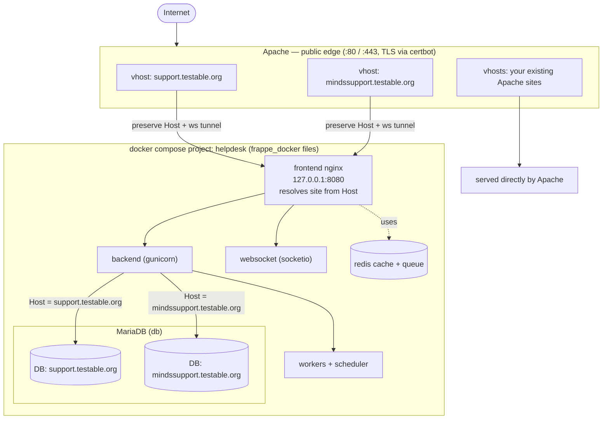

# Self-hosted Frappe Helpdesk (one folder, Docker, two sites)

One folder you clone and run. It hosts **Frappe Helpdesk** for two sites:

- `support.testable.org`
- `mindssupport.testable.org`

Both run on **one bench** (one container stack) with **fully separate databases**,
resolved by hostname (Frappe DNS-based multitenancy). It:

- uses the **official prebuilt image** pinned to **`ghcr.io/frappe/helpdesk:v1.22.1`**
  — the newest tag that still bundles the apps (newer tags are frappe-only, see
  [Troubleshooting](#troubleshooting)); no build step,
- runs on the maintained **`frappe_docker`** compose files, which the scripts
  **clone for you** (`./frappe_docker`) — no folder juggling,
- coexists with **Apache**, which keeps ports **80/443** as the public TLS edge
  and reverse-proxies to the bench on `127.0.0.1:8080`,
- coexists with an existing host **MySQL / Redis** — the containers publish no
  host ports (see [Coexistence](#coexistence-on-the-shared-host)).

## Quick start

```bash
git clone <this-repo> helpdesk && cd helpdesk
cp .env.example .env                 # then edit: DB_PASSWORD (+ sizing)
./deploy.sh                          # clones frappe_docker, pulls image, starts stack
ADMIN_PASSWORD='strong-pw' ./create-site.sh    # creates BOTH sites
# then wire Apache (below) and you're live
```

`deploy.sh` clones `frappe_docker` on first run and pulls the image — you never
leave this folder.

## Architecture

```
        Apache (:80/:443, TLS via certbot)         <-- public edge you already run
          |  support.testable.org       -> 127.0.0.1:8080  (Host preserved + ws)
          |  mindssupport.testable.org  -> 127.0.0.1:8080  (Host preserved + ws)
          |  your existing Apache sites -> served by Apache directly
          v
   frontend (nginx) on 127.0.0.1:8080         <-- compose project "helpdesk"
          |  resolves the site from the Host header
          +--> backend (gunicorn) + websocket (socketio) + workers + scheduler
          v
        MariaDB (db)            support.testable.org      -> its own database
                                mindssupport.testable.org -> its own database
        + redis-cache, redis-queue (internal)
```



| Component | Version |
|-----------|---------|
| Image | `ghcr.io/frappe/helpdesk:v1.22.1` (official, prebuilt, multi-arch) |
| Frappe | `version-15` |
| Helpdesk | `v1.22.1` (newest tag that still bundles the apps) |
| Telephony | bundled (hard dependency — see below) |

**Why telephony?** It's a hard dependency of Helpdesk — `helpdesk/hooks.py`
declares `required_apps = ["telephony"]` and `pyproject.toml` pins it. Frappe
refuses to install `helpdesk` without it. It's already in the official image and
installed automatically; ignore its UI if you don't use call features.

## Files

| File | Purpose |
|------|---------|
| `.env.example` | Copy to `.env`; image tag, DB password, port, sizing. |
| `deploy.sh` | Update frappe_docker, pull image, start the stack. |
| `create-site.sh` | One-time: create **both** sites + install apps. |
| `destroy.sh` | ☢️ **Permanently** delete this stack + all its volumes (scoped to project `helpdesk`). |
| `dc.sh` | `docker compose` wrapper (auto-clones frappe_docker; right `-f` flags). |
| `apache/*.conf` | Apache vhosts: TLS + proxy + websockets (one per site). |
| `frappe_docker/` | Cloned automatically by the scripts — **not** committed (gitignored). |

Run any compose command via the wrapper, e.g. `./dc.sh ps`, `./dc.sh logs -f`,
`./dc.sh down`.

## Deploy

### 0. Prereqs
Docker + Docker Compose v2, `git`; Apache with `mod_proxy mod_proxy_http
mod_proxy_wstunnel mod_ssl mod_rewrite mod_headers`; DNS A-records for both
hostnames pointing at the server.

### 1. Configure & start
```bash
cp .env.example .env          # set DB_PASSWORD (and worker sizing if you like)
./deploy.sh                   # clones frappe_docker, pulls image, starts everything
```

### 2. Create both sites (first run only)
```bash
ADMIN_PASSWORD='set-a-strong-one' ./create-site.sh
```
(`create-site.sh` reads `DB_PASSWORD` from `.env` automatically.)

### 3. Wire up Apache (both domains)
```bash
sudo a2enmod proxy proxy_http proxy_wstunnel ssl rewrite headers       # Debian/Ubuntu
sudo cp apache/support.testable.org.conf      /etc/apache2/sites-available/
sudo cp apache/mindssupport.testable.org.conf /etc/apache2/sites-available/
sudo certbot certonly --webroot -w /var/www/html -d support.testable.org
sudo certbot certonly --webroot -w /var/www/html -d mindssupport.testable.org
sudo a2ensite support.testable.org mindssupport.testable.org
sudo apachectl configtest && sudo systemctl reload apache2
```
Open `https://support.testable.org/helpdesk` and
`https://mindssupport.testable.org/helpdesk` (login `admin` / your password).

## Day-2 operations

### Update / upgrade (covers BOTH sites)
Bump `CUSTOM_TAG` in `.env` to a newer **app-bundling** tag (see Troubleshooting
for which are safe), then:
```bash
./deploy.sh                                           # pulls new image, recreates
./dc.sh exec -T backend bench --site support.testable.org      migrate
./dc.sh exec -T backend bench --site mindssupport.testable.org migrate
```
⚠️ Until Frappe fixes their image CI, **don't bump past `v1.22.1`** — newer tags
are frappe-only and will break your sites. To run newer Helpdesk before then,
switch to building the image yourself (see Troubleshooting).

### Backups (per site — each has its own DB)
```bash
./dc.sh exec -T backend bench --site support.testable.org      backup --with-files
./dc.sh exec -T backend bench --site mindssupport.testable.org backup --with-files
```
Back up the `helpdesk_db-data` and `helpdesk_sites` volumes off-box (the
`site_config.json` in `sites` holds each site's encryption key — a DB dump is
useless without it).

### Add a third Helpdesk site later (same bench)
```bash
./dc.sh exec -T backend bench new-site third.example.com \
  --no-mariadb-socket --db-root-username root \
  --mariadb-root-password "$DB_PASSWORD" --admin-password 'pw' \
  --install-app telephony --install-app helpdesk
```
Add an Apache vhost (copy one of the existing ones, change `ServerName` + cert).
No new containers.

### Reset / tear down (DANGER — erases data)
```bash
./destroy.sh                 # asks you to type "erase helpdesk"; then deletes
                             # all helpdesk containers, networks, and VOLUMES
                             # (both DBs + all uploaded files — irreversible)
FORCE=1 ./destroy.sh         # skip the prompt (automation)
```
Scoped to the `helpdesk` project only — your other Docker stacks, host
MySQL/Redis, and Apache are untouched. Redeploy with `./deploy.sh && ./create-site.sh`.

## Persistence: where files and databases live

Everything stateful is in **Docker named volumes** (project `helpdesk`), so
recreating containers never loses data.

| Volume | Mounted at | Holds |
|--------|-----------|-------|
| `helpdesk_sites` | `/home/frappe/frappe-bench/sites` | uploaded files (`<site>/public\|private/files`), each site's `site_config.json` (incl. **encryption key**), backups |
| `helpdesk_db-data` | `/var/lib/mysql` | **all** site databases (one per site) |
| `helpdesk_redis-queue-data` | `/data` | queued background jobs |

- **Files** are stored on disk, not in the DB (the DB holds only a `File`
  metadata row). Both sites share `helpdesk_sites`, isolated by directory.
- **Databases**: one MariaDB server, but `bench new-site` gives **each site its
  own database** (name/user/password recorded in that site's `site_config.json`).
- `redis-cache` has no volume — cache is ephemeral by design.

> ⚠️ `./dc.sh down -v` (or `docker volume rm`) **permanently deletes** these
> volumes. Use plain `./dc.sh down` for routine stop/recreate.

## Coexistence on the shared host

The only host port this stack binds is **`127.0.0.1:8080`** (loopback, for
Apache). Everything else is internal to Docker networks.

| Host port | Bound by this stack? | Notes |
|-----------|----------------------|-------|
| `80` / `443` | No | your Apache keeps them |
| `127.0.0.1:8080` | Yes (loopback only) | bench nginx; Apache proxies to it |
| `3306` (MySQL) | **No** | container MariaDB is internal only — your host MySQL is untouched |
| `6379` (Redis) | **No** | container Redis is internal only — your host Redis is untouched |

The `db`/`redis-*` services publish no `ports:`, so they never collide with an
existing host MySQL or Redis. Frappe also runs its **own** Redis, separate from
whatever your host Redis serves.

## Troubleshooting

**`create-site.sh` fails: "No module named 'telephony'" (or helpdesk not found).**
The image doesn't contain the apps. On **2026-04-05** `frappe_docker` changed its
Containerfile to read the app list only from a BuildKit **secret** (`id=apps_json`),
but Helpdesk's CI still passes `APPS_JSON_BASE64` as a build-arg, which is now
ignored. So every `ghcr.io/frappe/helpdesk` image built **after that date is
frappe-only**: `v1.22.2`+, `stable`, `main`.

Confirm what's in any image:
```bash
docker run --rm ghcr.io/frappe/helpdesk:<tag> ls apps   # want: frappe helpdesk telephony
```
Fixes:
- **This setup pins `v1.22.1`** — the newest tag built *before* the break, so it
  still bundles the apps. Don't bump past it until upstream is fixed.
- **Want newer Helpdesk now?** Build it yourself with the secret the Containerfile
  expects:
  ```bash
  printf '[{"url":"https://github.com/frappe/telephony","branch":"develop"},
          {"url":"https://github.com/frappe/helpdesk","branch":"main"}]' > apps.json
  git clone --depth 1 https://github.com/frappe/frappe_docker
  DOCKER_BUILDKIT=1 docker build \
    --build-arg=FRAPPE_BRANCH=version-15 \
    --secret=id=apps_json,src=apps.json \
    --tag=helpdesk-local:v15 \
    --file=frappe_docker/images/layered/Containerfile frappe_docker
  ```
  then set `CUSTOM_IMAGE=helpdesk-local`, `CUSTOM_TAG=v15`, `PULL_POLICY=never` in `.env`.

## Design notes
- **Official prebuilt image, pinned to `v1.22.1`** — immutable, assets
  pre-compiled; upgrades are `pull` + `migrate`. Pinned to the last tag that
  bundles the apps (newer ones are frappe-only); see
  [Troubleshooting](#troubleshooting) for the build-it-yourself escape hatch.
- **frappe_docker compose, not a hand-rolled one** — the scripts use the
  upstream-maintained `compose.yaml` + `mariadb`/`redis`/`noproxy` overrides, so
  you track Frappe's production layout instead of a local fork.
- **One bench, two sites** — shared compute, isolated databases; one image tag
  upgrades both.
- **Apache edge, bench on localhost** — nginx binds `127.0.0.1:8080` only, so the
  bench isn't publicly reachable; Apache keeps TLS and 80/443.
  `ProxyPreserveHost On` drives hostname→site routing; `mod_proxy_wstunnel`
  carries Frappe's socket.io websockets (required for realtime/notifications).

## Sources
- frappe_docker — https://github.com/frappe/frappe_docker
- Helpdesk (image + telephony dependency) — https://github.com/frappe/helpdesk
- Helpdesk image tags — https://github.com/frappe/helpdesk/pkgs/container/helpdesk
- Multi-tenancy — https://github.com/frappe/frappe_docker/blob/main/docs/03-production/03-multi-tenancy.md
